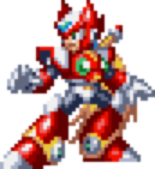
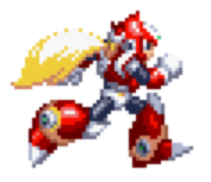

# XUTP — Megaman X4 Fighting Game (KMP)

Port de un juego de pelea 2D estilo Megaman X4, originalmente desarrollado en Java con Greenfoot como proyecto universitario. Ahora portado a Android e iOS con Kotlin Multiplatform y Compose Multiplatform.

<p style="text-align: center;">
  
</p>

## Estado actual

El proyecto está en fase inicial. Por ahora se puede:

- Mover al personaje Zero por el escenario usando teclado (flechas / WASD) o D-pad virtual táctil
- Animación de reposo (6 frames) con flip horizontal según dirección
- Animación de correr (13 frames por dirección)
- Salto con gravedad y colisión con el suelo
- Game loop con delta time (`withFrameNanos`) para velocidad consistente en cualquier dispositivo
- Física con aceleración y desaceleración gradual
- Pantalla forzada en landscape (Android e iOS)
- Pantalla completa inmersiva en Android

<table>
  <tr>
    <td style="text-align: center;"><br/><sub>Reposo</sub></td>
    <td style="text-align: center;"><br/><sub>Correr</sub></td>
  </tr>
</table>

## Stack

| Tecnología | Uso |
|---|---|
| Kotlin 2.3.0 | Lenguaje principal |
| Compose Multiplatform 1.10.0 | UI y Canvas para renderizado 2D |
| KMP | Código compartido Android / iOS |
| Gradle (Kotlin DSL) | Build system |

## Arquitectura

```
co.crhystian.xutp/
├── domain/model/     → Modelos puros: Character, CharacterState, Direction, GameConstants
├── data/             → ZeroSpriteRepository: mapea estados a frames de sprites
├── game/             → Lógica pura: PhysicsEngine, AnimationController, InputState
├── presentation/     → GameViewModel, GameScreen (Canvas), DpadOverlay
└── App.kt            → Entry point
```

## Controles

| Input | Acción |
|---|---|
| ← → / A D | Mover |
| ↑ / W / Espacio | Saltar |
| ↓ / S | Agacharse (pendiente) |
| D-pad táctil | Mover (pantalla táctil) |

## Plataformas

- Android (minSdk 29, targetSdk 36)
- iOS (arm64, simulador arm64)

## Build

```bash
# Android APK
./gradlew :composeApp:assembleDebug

# iOS (requiere Xcode)
# Abrir iosApp/iosApp.xcodeproj y compilar desde Xcode
```

## Sprites

El juego usa sprites PNG del proyecto original, renombrados a lowercase para compatibilidad con Compose Resources. Los sprites de Zero incluidos actualmente:

| Animación | Prefijo | Frames |
|---|---|---|
| Reposo | `rez` | 6 (0-5) |
| Correr derecha | `mrd` | 13 (0-12) |
| Correr izquierda | `mrzd` | 13 (0-12) |

Escenario original: 511×384 px, escalado proporcionalmente a la pantalla del dispositivo.
